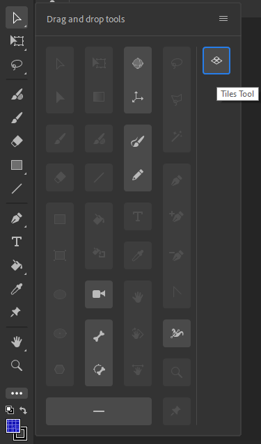
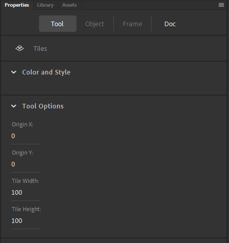

# Tiles Tool
The tool for Adobe Animate that allows to quickly place symbols as tiles.

## Installation
* Copy the contents of `/dist` folder into the tools directory:\
Windows® 10™:
`boot drive\Users\username\AppData\Local\Adobe\Animate version\language\Configuration\Tools`\
Mac OS® X:
`Macintosh HD/Users/username/Library/Application Support/Adobe/Animate version/language/Configuration/Tools`

* Launch Adobe Animate

* Select the tool and drag it to the desired position in the Toolbar:\

## Using the Tool

* Select the tool in the Toolbar.
* Select the `Properties > Tool` panel. Set the origin position and size of the tile you want to draw:\

* Select a symbol in the library that will be used as a tile.
* Draw tiles on the stage. Click to place a single tile, drag to draw multiple tiles.\
If other symbols are on the same layer they will be replaced with the selected tile in the drawn region.\
Tile position will be calculated using origin position and tile size from the tool options.
